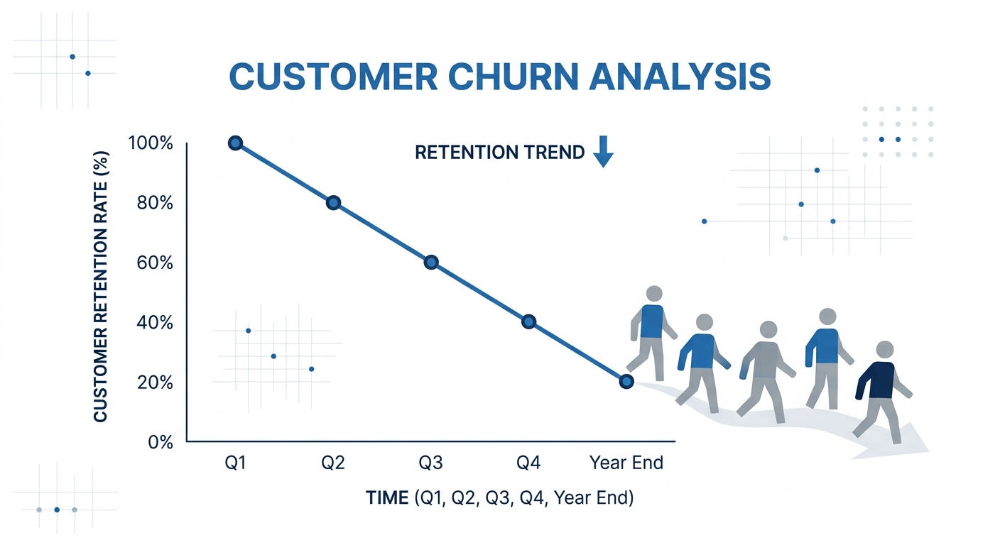

# Customer Churn Analysis  

  

## Dataset

## Libraries

- `pandas`
- `numpy`
- `matplotlib`
- `seaborn`
- `scipy`

## Step1

- [ ] Categorical descriptive statistics
- [ ] Frequency tables
- [ ] Contingency tables
- [ ] Categorical visualizations
- [ ] Interpreting business insights
